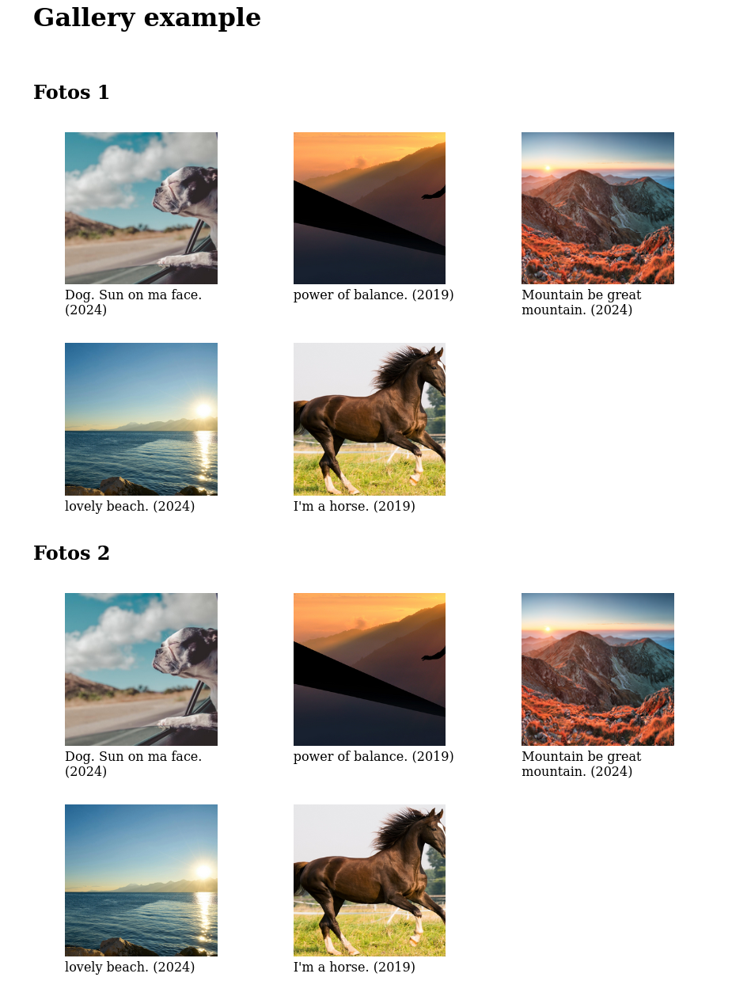
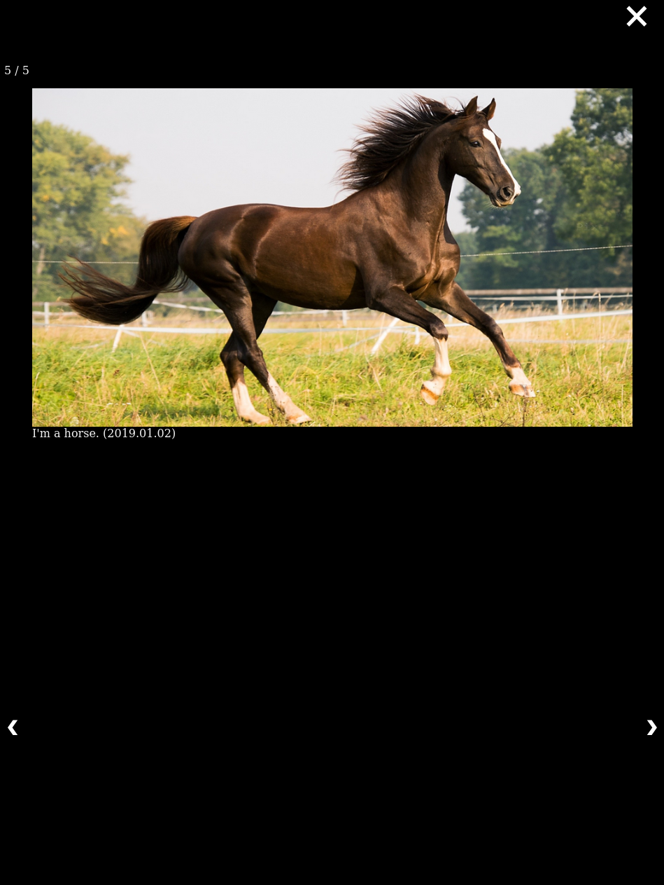

# gallery lightbox creator

javascript to automatically create gallery and lightbox.

|        gallery         |        lightbox        |
| :--------------------: | :--------------------: |
|  |  |

## install

1. add `Gallerybuilder.js` and `gallerybuilder.css` to your project.

2. install dependencies:

```bash
npm install # from package.json
```

3. add to your html:

```html
<!-- website.html -->
<script src="./node_modules/utf8/utf8.js"></script>
<script src="./node_modules/exif-js/exif.js"></script>
<script src="./gallerybuilder.js"></script>
<link rel="stylesheet" href="./gallerybuilder.css" />
```

## usage

```html
<!-- website.html -->
<script type="module">
  var instance1 = new galleryBuilder(
    "Gallery1", // reference to html container with id
    [
      "./foto-1.jpg",
      "./foto-2.jpg",
      "./foto-3.jpg",
      "./foto-4.jpg",
      "./foto-5.jpg",
    ],
    true, // thumbnails are in a /thumbnails/ directory and have same name image file; default = false
  );

  instance1.build();
  instance1.captions({dateGallery: false, dateModal: true});

  var instance2 = new galleryBuilder(
    "Gallery2", // reference to html container with id
    [
      "./foto-1.jpg",
      "./foto-2.jpg",
      "./foto-3.jpg",
      "./foto-4.jpg",
      "./foto-5.jpg",
    ],
  );

  instance2.build();
  instance2.captions({});
</script>
<body>
  <h1>Gallery example</h1>
  <br />
  <h2>Fotos 1</h2>
  <div class="Gallery" id="Gallery1"></div>
  <h2>Fotos 2</h2>
  <div class="Gallery" id="Gallery2"></div>
</body>
```

buildCaptions needs an dictionaty as parameter. An empty one, `{}`, for default values displaying dates in Gallery and Lightbox/Modal. Or eg.: `{dateGallery: false, dateModal: true}` to not show dates in Gallery but in Lightbox/Modal.

## limitations

integration of exif-js into class method, hacky at best. but it works.

images need to be .jpg file format.

## potential improvements

### major
* incude videos
* order (html hierarchy) of items in modal not right, compare to source w3 page https://www.w3schools.com/howto/howto_js_lightbox.asp
* make mobile friendly (swiping)
* add little map with a marker of where image was taken if image has geo-data
    * or parse countries from gps coords
* include other image file types, eg png

### minor
* rebrand galBox-js
* improve styling 
    * move image counter from top right of screen to top right of image displayed
    * move next/prev buttons from left and right of screen to left and right of image displayed

## credits

based on: https://www.w3schools.com/howto/howto_js_lightbox.asp
