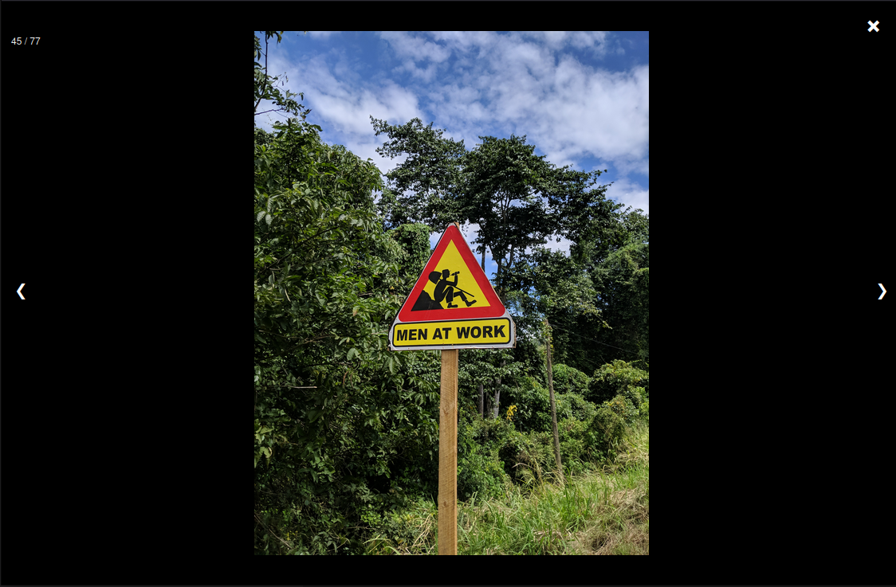

# simple light box

adds a lightbox feature with a gallery, like this:



based on: https://www.w3schools.com/howto/howto_js_lightbox.asp

## installation


1. just add both files to your project:
- lightbox.css
- lightbox.js


2. include the files in the your html file by adding following lines with the right path to the files just copied:
    ```
        <link rel="stylesheet" href="./lightbox.css" />
        <script defer src="./lightbox.js"></script> 
    ```
3. have your gallery in a div container and add the class "Gallery" to it, like in this:
    ```
        <div class="Gallery">
            
            
            
            
        </div>
    ```

## to-do

- improve styling 
- move image counter from top right of screen to top right of image displayed
- move next/prev buttons from left and right of screen to left and right of image displayed
- currently adds one modal element, even for multible gallerys. add a modal element for every gallery element, eg.: 3 modals for 3 galleries. 
- make mobile friendly
- add caption and date of image as text besides or below image 
- add little map with a marker of where image was taken if image has geo-data`